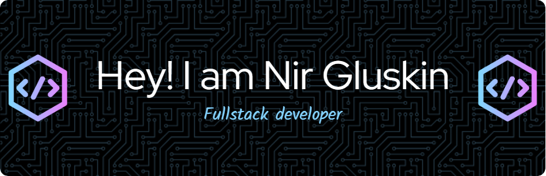

  

- 🌱 I’m currently learning **JavaScript & Python**

- 💬 Ask me about **anything**

- 📫 How to reach me **glusknir@gmail.com**

- ⚡ Fun fact **I'm also a racing driver**

<h3 align="left">Languages and Tools:</h3>

 
  
  
  
  
  
  
  
  
  
  
  
  
  

